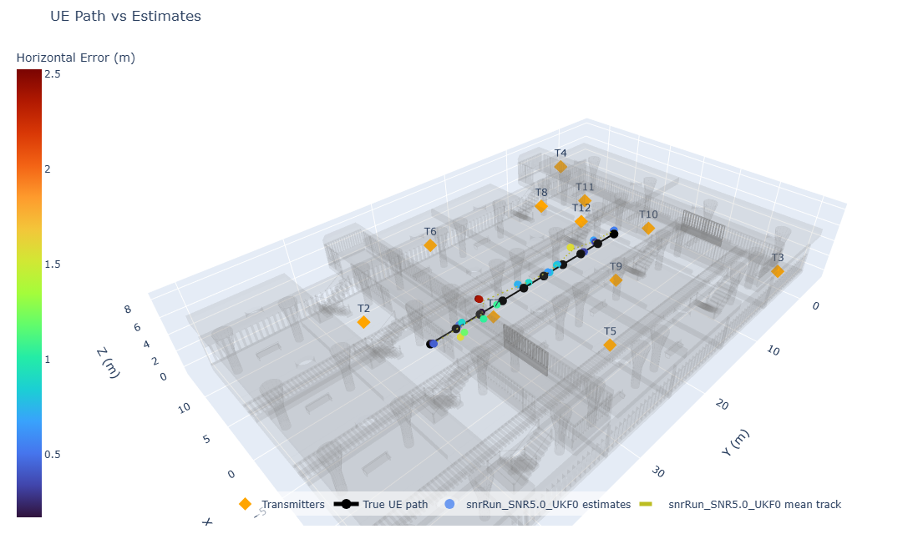
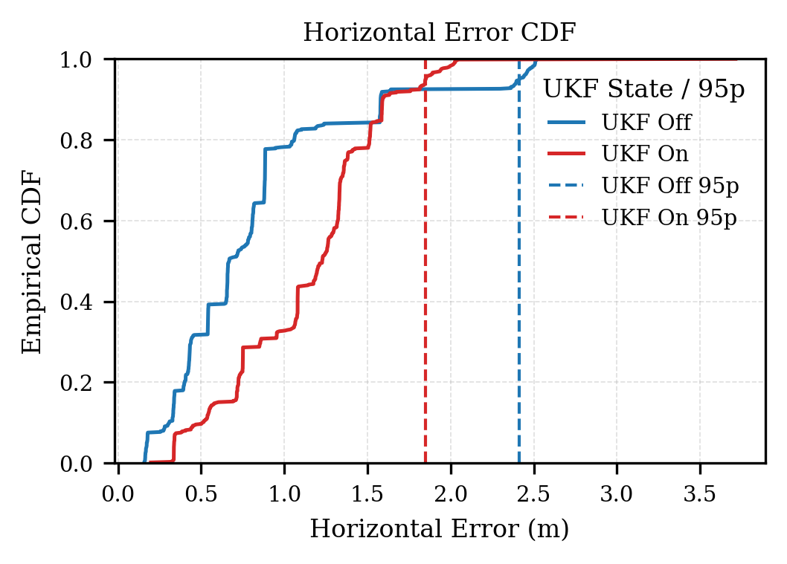
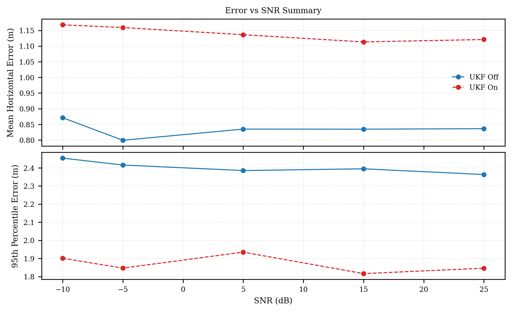
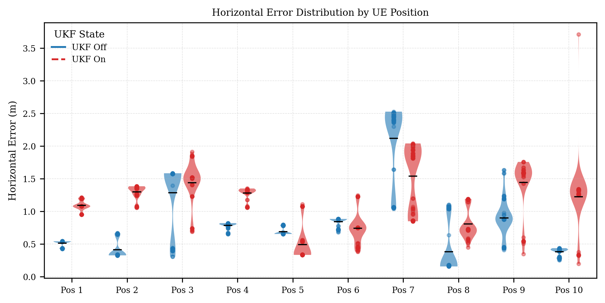
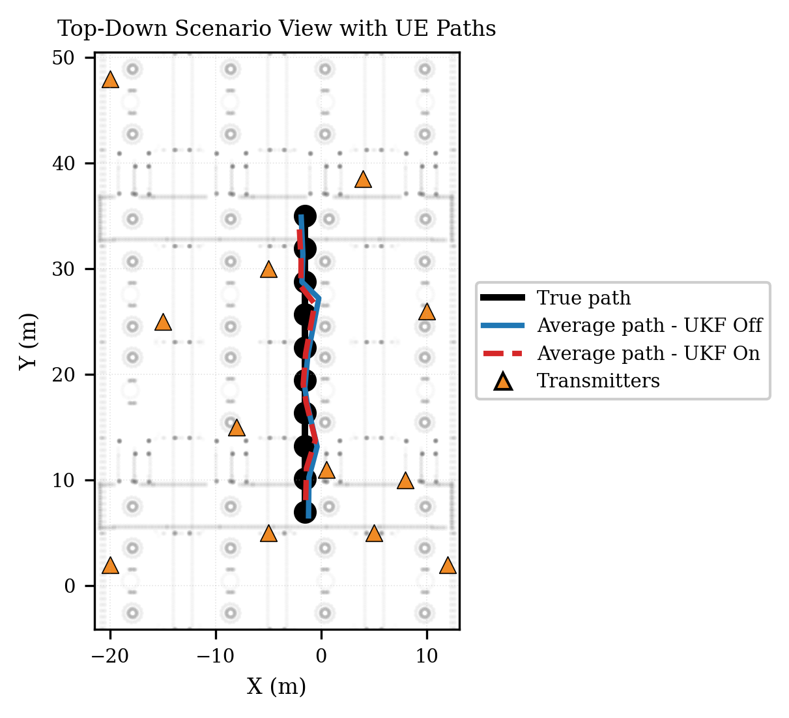

# 5G Indoor Positioning: RANSAC-UKF Tracking Pipeline

Robust indoor positioning using 5G NR Positioning Reference Signals (PRS) with multipath rejection and Kalman filtering.


*12 gNodeBs in a ray-traced train station with UE trajectory*

## Results

| Metric | RANSAC-only | RANSAC + UKF |
|--------|-------------|--------------|
| Median error | 0.67 m | 1.23 m |
| 95th percentile | 2.41 m | **1.85 m** |

**23% reduction in worst-case error** — UKF trades slight median bias for tighter tails.

### Error Distribution


### Error vs SNR


### Spatial Error by Position


### Trajectory Comparison


## Method

```
PRS Signals → TDoA Estimation → RANSAC Outlier Rejection → UKF Tracking → Position
```

1. **TDoA Estimation** — Correlate 5G PRS with local replicas
2. **RANSAC** — Sample anchor triplets, reject NLOS outliers
3. **Gauss-Newton** — Solve hyperbolic intersection on inliers
4. **UKF** — Constant-velocity prior smooths trajectory

## Simulation Setup

| Parameter | Value |
|-----------|-------|
| Transmitters | 12 gNodeBs |
| Carrier | 3.5 GHz |
| Bandwidth | 100 RB PRS (30 kHz SCS) |
| Channel | Ray tracing (2 refl, 1 diffr) |
| SNR range | -10 to 25 dB |
| Trials | 1,300 Monte Carlo |

## Quick Start

```matlab
% Configure in PositioningConfig.m, then run:
main_5g_positioning
```

```bash
# Generate plots
python generate_positioning_plots.py
```

## Tech Stack

`MATLAB` `5G Toolbox` `Ray Tracing` `RANSAC` `UKF` `Python`

---

*Research project @ TU Hamburg, Institut für Hochfrequenztechnik*
